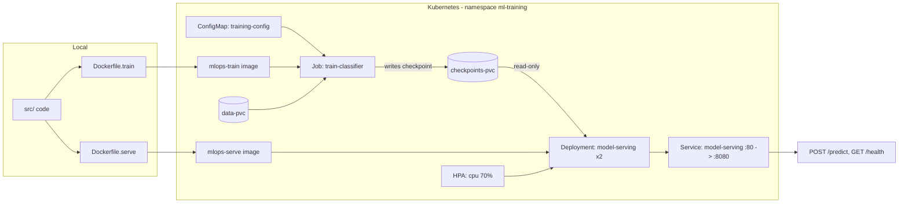

# mlops-pytorch-pipeline

**Author:** Mohasin Momin (da25m592)

**Evaluated branch:** `main`. Work happens on `feature/*` branches merged into `develop` via
PRs with descriptions; `develop` is merged into `main` via a PR. Commits follow Conventional
Commits, one logical change each.

A PyTorch CIFAR-10 image classifier taken through the full deployment lifecycle: local
development, containerized training with Docker, and orchestrated training and serving on
Kubernetes.

## System architecture



## Project layout

```
src/            model, dataset, training loop, FastAPI serving app
configs/        training hyperparameters (YAML)
docker/         multi-stage Dockerfiles for train and serve
k8s/            namespace, configmap, job, deployment, service, hpa
requirements/   pinned dependencies: train, serve, dev
tests/          model shape/sanity tests
docs/           end-to-end validation checklist and write-up
.github/        CI workflow (lint, tests, image build + smoke test)
```

## Local setup

Developed and run in WSL2 (Ubuntu) with Docker and a local Kubernetes cluster.

```bash
python -m venv .venv && source .venv/bin/activate
pip install -r requirements/train.txt -r requirements/serve.txt -r requirements/dev.txt
```

## Training

Downloads CIFAR-10 to `./data` and writes the best checkpoint to `./checkpoints`:

```bash
mkdir -p data checkpoints
TRAINING_CONFIG=configs/training_config.yaml PYTHONPATH=src python src/train.py
```

Hyperparameters (architecture, epochs, batch size, learning rate, early stopping patience,
paths) come from `configs/training_config.yaml`. The script resolves the config from
`TRAINING_CONFIG`, then `/app/configs/training_config.yaml`, then `configs/`. Metrics are
printed to stdout as JSON lines.

## Tests

```bash
PYTHONPATH=src pytest -q
```

## Docker

```bash
# Training
docker build -f docker/Dockerfile.train -t mlops-train:v1 .
docker run --rm -v $(pwd)/data:/app/data -v $(pwd)/checkpoints:/app/checkpoints mlops-train:v1

# Serving
docker build -f docker/Dockerfile.serve -t mlops-serve:v1 .
docker run --rm -p 8080:8080 -v $(pwd)/checkpoints:/app/checkpoints mlops-serve:v1

curl http://localhost:8080/health
curl -X POST http://localhost:8080/predict -F "image=@test_image.png"
```

The training and serving images have separate pinned requirements. The serving image uses a
slim base, installs inference deps only, runs as a non-root user, exposes 8080 and has a
HEALTHCHECK. The checkpoint is mounted, not baked in.

## Kubernetes

Load the locally built images into the cluster (minikube shown):

```bash
minikube image load mlops-train:v1
minikube image load mlops-serve:v1
```

Run training as a Job:

```bash
kubectl apply -f k8s/namespace.yaml
kubectl apply -f k8s/configmap.yaml
kubectl apply -f k8s/training-job.yaml
kubectl logs -f job/train-classifier -n ml-training
kubectl wait --for=condition=complete job/train-classifier -n ml-training --timeout=1800s
```

The Job mounts the `training-config` ConfigMap at `/app/configs`, uses the `data-pvc` and
`checkpoints-pvc` PersistentVolumeClaims, and sets CPU/memory requests and limits to
2 cores / 4Gi.

Deploy serving once training has completed:

```bash
kubectl apply -f k8s/serving-deployment.yaml
kubectl apply -f k8s/serving-service.yaml
kubectl apply -f k8s/hpa.yaml

kubectl get pods -n ml-training
kubectl describe deployment model-serving -n ml-training

kubectl port-forward svc/model-serving 8080:80 -n ml-training
curl -X POST http://localhost:8080/predict -F "image=@test_image.png"
```

The Deployment runs 2 replicas, mounts the checkpoint PVC read-only, has liveness (every 10s,
threshold 3) and readiness (every 5s, 15s initial delay) probes on `/health`, sets requests
500m/1Gi and limits 1/2Gi, and uses a rolling update with `maxSurge: 1` / `maxUnavailable: 0`.
The Service is ClusterIP, port 80 to container 8080.

Full step-by-step validation commands and the reflection write-up are in
[`docs/VALIDATION.md`](docs/VALIDATION.md).
